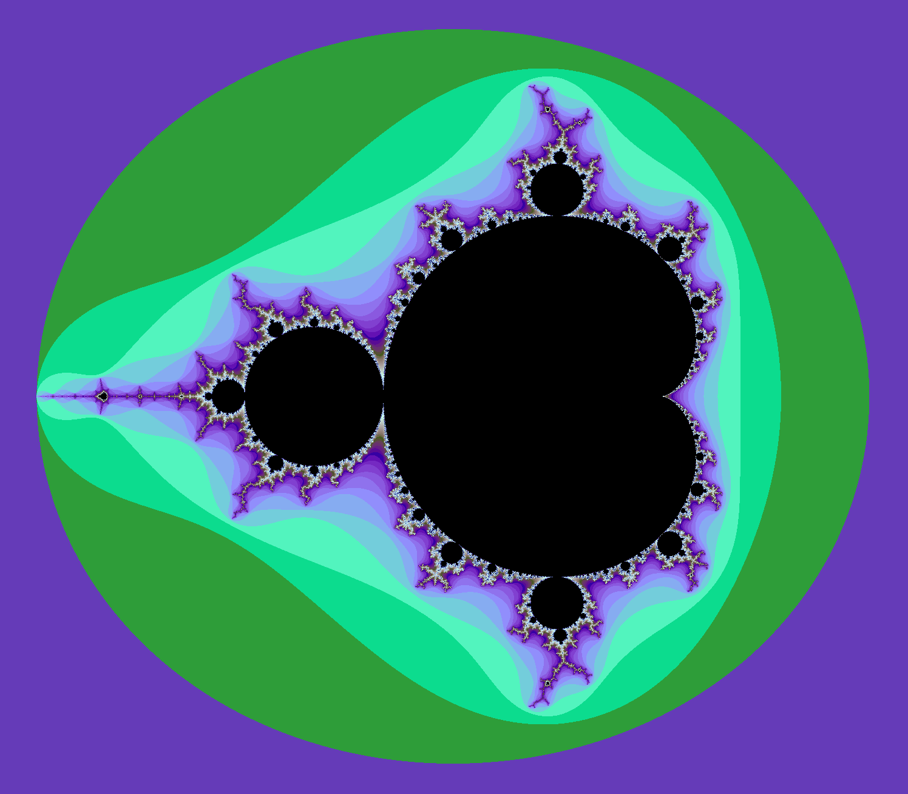

# OpenGL Mandelbrot
A GPU implementation of the Mandelbrot fractal with Rust and OpenGL.

## Exampels

## Building and running the program
This program depends on Rust/Cargo to compile. It can be installed through rustup: <https://rustup.rs/>.

Then run `cargo run --release` in the main directory of this repository to build and run the program.

## Interaction and Commands
There are basic controls through clicking and scrolling. Clicking changes the center of the image to the clicked location. Scrolling zooms in or out.

There are also a few commands that can be entered in the console. The basic commands are:
* `zoom # starts zooming into the current center.`
* `export # outputs the current settings in a way that they can be pasted in the console to get the same settings back.`
* `reloadshader # reloads src/triangle.frag and src/triangle.vert from disk`

It is also possible to change draw parameters. Through the syntax `<varname> <operator> <value>`. For example:
* `x= -0.53 # set the x-coordinate of the center to -0.53`
* `s *= 2 # zoom out with a factor of 2`
* `s/=10 # zoom in with a factor of 10`
  
The variable names are:
* `s # zoom scale`
* `x # x-coordinate of the center`
* `y # y-coordinate of the center`
* `i # maximum iterations until the pixel will get be colored black`
* `z # how much should be zoomed per millisecond when zooming with the zoom command`
* `c # the index of the function used for coloring`

The operators are:
  * `=`
  * `*=`
  * `/=`
  * `+=`
  * `-=`

Values are numbers.